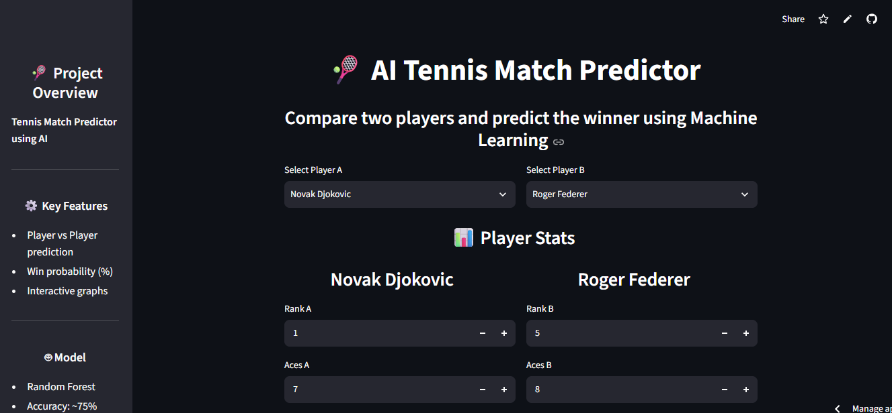
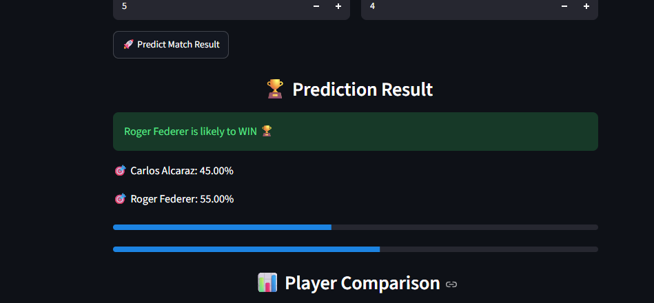
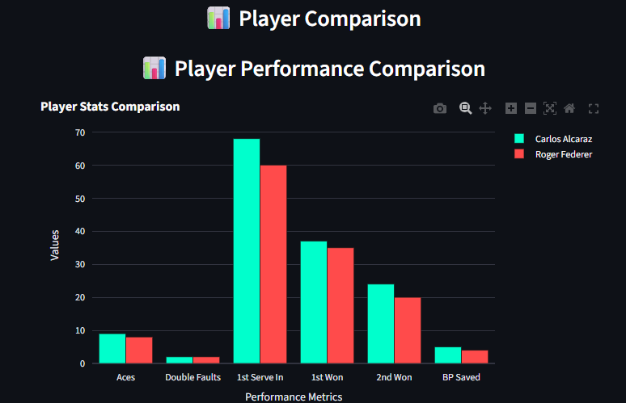

# 🎾 Tennis Match Prediction using AI

A Machine Learning web application that predicts the outcome of a tennis match by comparing two players based on their performance statistics. The application uses a **Random Forest Classifier** to estimate the winning player along with win probabilities and interactive visualizations.

---

## 🚀 Live Demo

🔗 **Streamlit App:**  
https://tennis-match-prediction-akejk8szjrjechhcguvwbk.streamlit.app/

---

## 📌 Project Overview

This project allows users to:

- Compare two tennis players
- Predict the likely winner using Machine Learning
- View win probabilities for both players
- Compare player performance through interactive graphs
- Track previous predictions during the session

---

## 📸 Application Screenshots

### 🏠 Home Page



---

### 🏆 Match Prediction



---

### 📊 Performance Comparison



---

## ✨ Features

- 🎾 Player vs Player Match Prediction
- 🤖 Random Forest Machine Learning Model
- 📈 Win Probability Estimation
- 📊 Interactive Plotly Graphs
- 📜 Prediction History
- 🌙 Modern Dark Theme UI
- ⚡ Fast and Lightweight Streamlit Interface

---

## 🛠️ Tech Stack

### Programming Language
- Python

### Machine Learning
- Scikit-learn
- Joblib
- NumPy
- Pandas

### Web Framework
- Streamlit

### Visualization
- Plotly
- Matplotlib

### Report Generation
- ReportLab

---

## 📂 Project Structure

```text
tennis-match-prediction/
│
├── app.py
├── tennis_model.pkl
├── requirements.txt
├── README.md
├── homepage.png
├── prediction_result.png
└── prediction_Graph.png
```

---

## ⚙️ Installation

### 1️⃣ Clone the Repository

```bash
git clone https://github.com/Navyaasree/tennis-match-prediction.git
```

### 2️⃣ Navigate to the Project

```bash
cd tennis-match-prediction
```

### 3️⃣ Install Dependencies

```bash
pip install -r requirements.txt
```

### 4️⃣ Run the Application

```bash
streamlit run app.py
```

---

## 🧠 Machine Learning Model

- Algorithm: **Random Forest Classifier**
- Problem Type: Classification
- Input Features:
  - Player Ranking
  - Number of Aces
  - Double Faults
  - First Serve In %
  - First Serve Won %
  - Second Serve Won %
  - Break Points Saved
- Output:
  - Predicted Winner
  - Win Probability (%)

---

## 📊 Libraries Used

- Streamlit
- NumPy
- Pandas
- Scikit-learn
- Plotly
- Matplotlib
- Joblib
- ReportLab

---

## 📈 Future Enhancements

- ATP Live Rankings Integration
- Real Match Dataset API
- Head-to-Head Statistics
- Tournament Prediction
- Player Performance Dashboard
- Historical Match Analysis
- User Authentication
- PDF Report Download

---

## 👩‍💻 Developer

**Navyasree**

**B.Tech – Artificial Intelligence & Data Science**

GitHub: https://github.com/Navyaasree

---

## ⭐ Support

If you found this project useful, consider giving it a ⭐ on GitHub.
